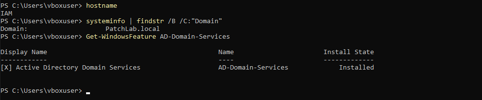
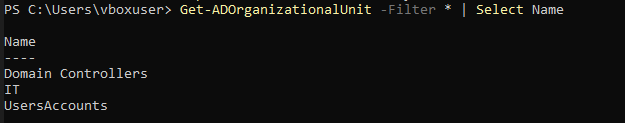
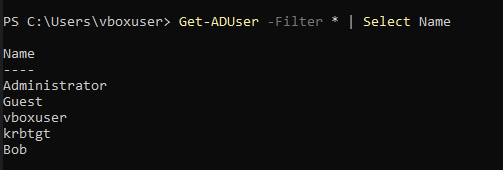
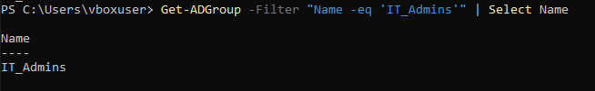
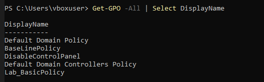
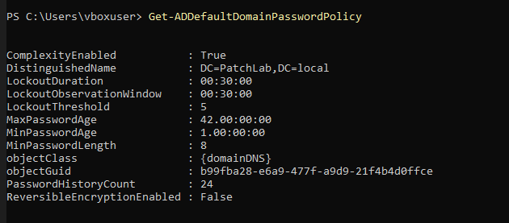
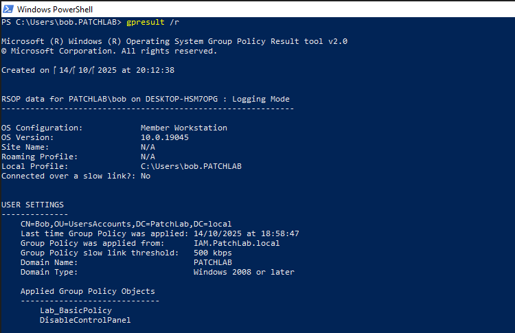
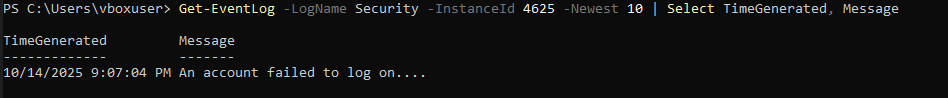
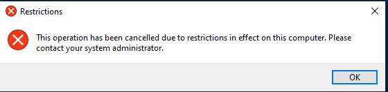
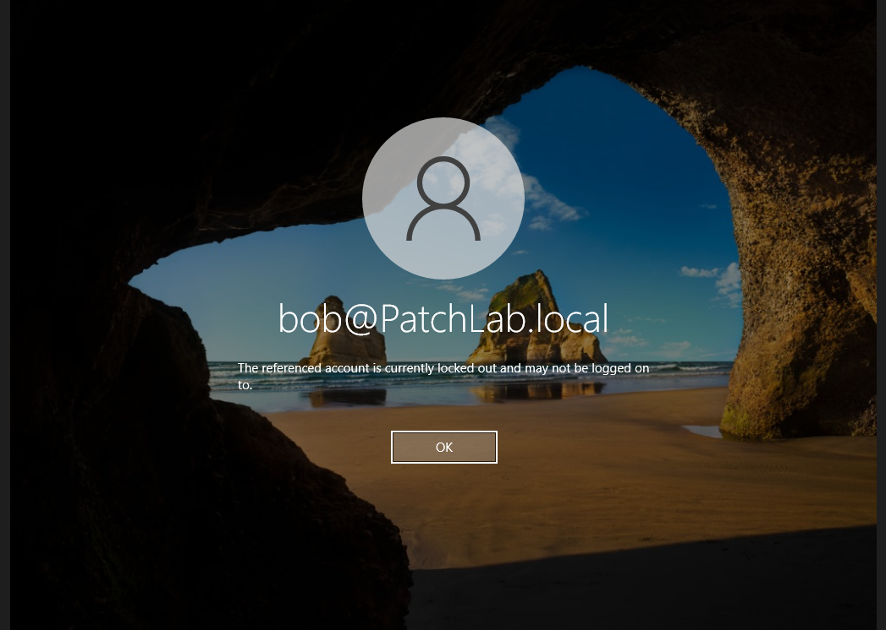

### 1. AD Installation

Shows Windows Server promoted as Domain Controller (PatchLab.local) with AD DS installed successfully.

### 2. Organizational Units and Users

Displays created OUs (UsersAccounts, IT), group (IT_Admins), and user (bob).

### 3. Group Policies Created

Verifies creation of 'DisableControlPanel' and 'BaselinePolicy' Group Policies.

### 5. Domain Password Policy

Shows domain password policy with complexity, length (8), and account lockout settings.

### 6. GPO Applied on Client

Confirms 'DisableControlPanel' GPO applied to Bob’s account on Windows 10 client.

### 7. Security Audit Event Log

Shows multiple failed logon attempts (Event ID 4625) generated during audit simulation.

### 8. Control Panel Restriction

Bob’s account successfully received the Disable Control Panel policy, confirming GPO application.

### 9. Lockout Account

Bob’s account locked after repeated failed login attempts, validating the Baseline Password & Lockout Policy.
